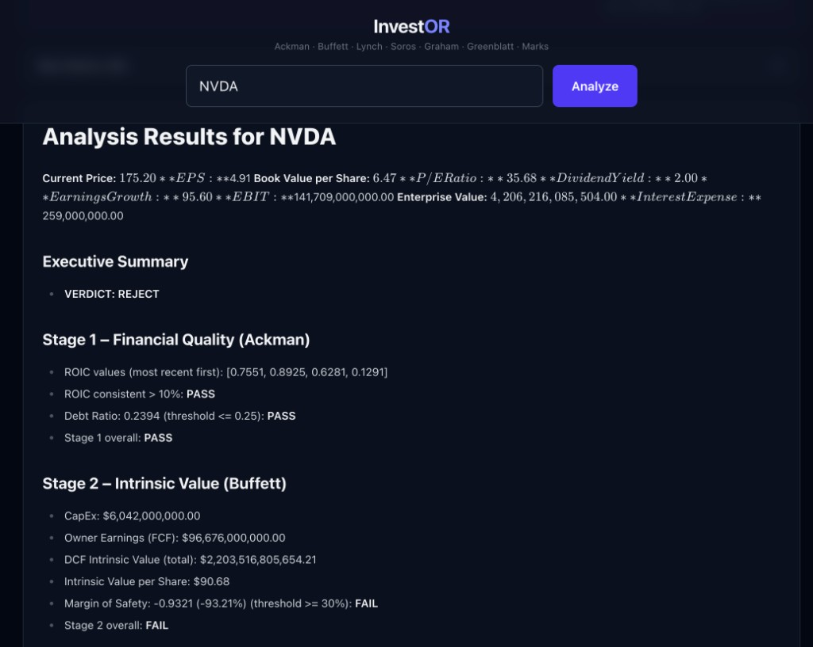
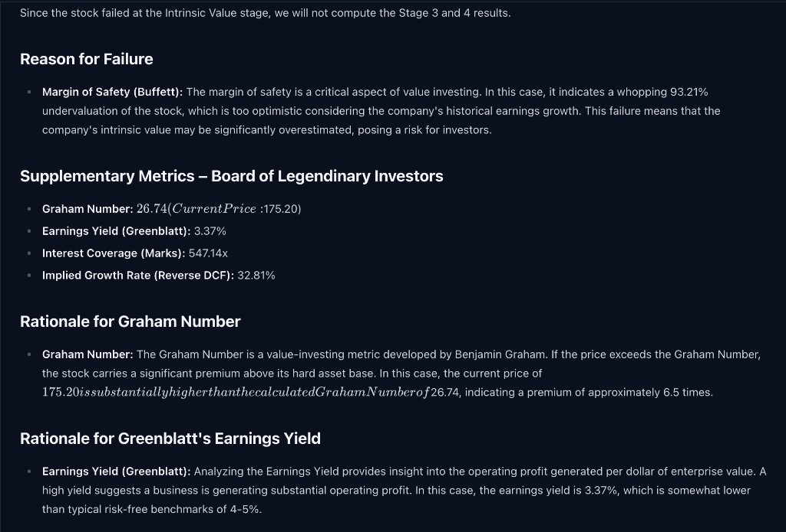
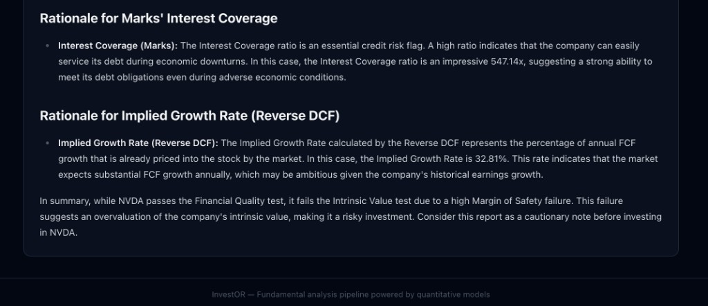
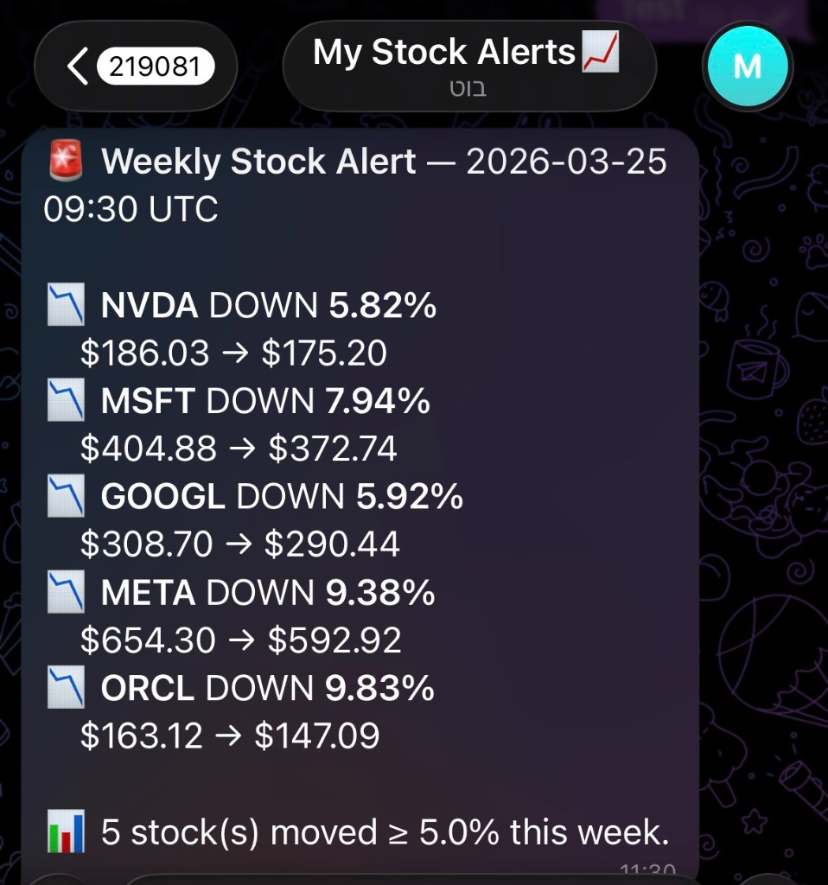

# 📈 InvestOR

A full-stack algorithmic stock analysis platform that evaluates public companies through a **7-investor mathematical pipeline** and generates an AI-powered investment report using a local LLM. 



Built with **FastAPI** (Python), **React** (TypeScript / Vite / Tailwind CSS), and **Azure Functions** for serverless cloud automation.

---

## ✨ Key Features

- **Interactive Web Dashboard:** Clean, responsive UI built with React and Tailwind CSS. Enter any stock ticker to instantly run the analysis pipeline.
- **7-Investor Quantitative Pipeline:** A strict mathematical gauntlet inspired by legendary investors (Ackman, Buffett, Lynch, Soros, Graham, Greenblatt, Marks).
- **"Board of Legendary Investors" LLM Analysis:** Uses a local **Ollama** LLM (Mistral) to act as a committee of legendary investors, interpreting the data and explaining exactly *why* a stock passed or failed.
- **Automated Cloud Alerts:** A Serverless Azure Function runs weekly (every Tuesday at 20:00 UTC) to scan a watchlist and send a formatted **Telegram alert** for any stock moving ±5%.

---

## 📸 UI & Functionality Showcase

### Comprehensive Metrics & Pass/Fail Criteria
The platform computes real-time Intrinsic Value (using a dynamic FCF-based DCF), Margin of Safety, ROIC, and more.


### LLM-Powered Rationale
Detailed, Markdown-rendered explanations generated locally and privately, analyzing both growth metrics and distressed-debt credit risk.


### Automated Telegram Alerts
Serverless Azure Function monitoring top tech stocks for weekly volatility, pushed directly to your phone.



---

## 🧮 The Pipeline

### Stage 1 — Financial Quality (Bill Ackman)
| Metric | Formula | Pass Condition |
|--------|---------|----------------|
| ROIC | (Net Income - Dividends) / (Equity + Debt - Cash) | > 10% consistently |
| Debt Ratio | Total Liabilities / Total Assets | ≤ 0.25 |

### Stage 2 — Intrinsic Value (Warren Buffett)
| Metric | Formula | Pass Condition |
|--------|---------|----------------|
| Owner Earnings (FCF) | Operating Cash Flow - \|CapEx\| | Must be positive |
| DCF Intrinsic Value | 5-year projection, 10% discount, 2.5% terminal growth | — |
| Margin of Safety | (IV/Share - Price) / IV/Share | ≥ 30% |

*Note: If Owner Earnings ≤ 0, the stock immediately fails Stage 2 (no DCF is attempted on negative cash flows).*

### Stage 3 — Growth Premium (Peter Lynch)
| Metric | Formula | Pass Condition |
|--------|---------|----------------|
| PEGY Ratio | P/E / (Growth Rate + Dividend Yield) | ≤ 1.0 |
| Lynch Fair Value | EPS × Growth Rate | — |

### Stage 4 — Risk Sizing (Kelly Criterion / George Soros)
*Only computed if Stages 1–3 all pass.*

| Metric | Formula |
|--------|---------|
| Risk/Reward (b) | (IV/Share - Price) / (Price × 0.5) |
| Full Kelly | p - (1-p)/b, where p = 0.60 |
| Half-Kelly | K/2, capped at 20% max allocation |

*The Half-Kelly halving is grounded in Soros's **Principle of Fallibility** and **Reflexivity** — protecting the portfolio because all valuation models are inherently flawed.*

### Supplementary Metrics
| Metric | Investor | Formula |
|--------|----------|---------|
| Graham Number | Benjamin Graham | √(22.5 × EPS × Book Value/Share) |
| Earnings Yield | Joel Greenblatt | EBIT / Enterprise Value |
| Interest Coverage | Howard Marks | EBIT / Interest Expense (⚠ warning if < 3.0) |
| Implied Growth Rate | Reverse DCF | Binary search for the exact growth rate currently priced in by the market |

---

## 🛠️ Tech Stack

| Layer | Technology |
|-------|-----------|
| **Backend API** | Python, FastAPI, yfinance, Pydantic |
| **Frontend** | React 19, TypeScript, Vite, Tailwind CSS |
| **Cloud Automation** | Azure Functions (Python Model V2, Timer Trigger) |
| **Integrations** | Telegram Bot API (`urllib` native HTTP) |
| **LLM Engine** | Ollama (local) with Mistral 7B |
| **Testing** | pytest (80+ unit and integration tests) |

---

## 🚀 Quick Start

### Prerequisites
- **Python 3.11+**
- **Node.js 18+**
- **Ollama** — install via [ollama.com](https://ollama.com) (`brew install ollama`)

### 1. Start the Local LLM (Ollama)
In a separate terminal, start the Ollama server and pull the Mistral model (one-time ~4GB download):
```bash
ollama serve
ollama pull mistral
```

### 2. Run the Backend API
```bash
cd backend

# Create and activate virtual environment
python -m venv .venv
source .venv/bin/activate

# Install dependencies
pip install -r requirements.txt

# Run the FastAPI server
uvicorn app.main:app --reload
```
*The API will run at `http://localhost:8000`.*

### 3. Run the Frontend Dashboard
In a new terminal:
```bash
cd frontend
npm install
npm run dev
```
*Open `http://localhost:5173` in your browser to use the dashboard.*

### 4. Setup Azure Stock Alerts (Optional)
The `stock-alerts` folder contains a Serverless Azure Function that runs every Tuesday.
```bash
cd stock-alerts
python -m venv .venv
source .venv/bin/activate
pip install -r requirements.txt

# Create your local.settings.json file and add your Telegram credentials:
# {
#   "IsEncrypted": false,
#   "Values": {
#     "AzureWebJobsStorage": "UseDevelopmentStorage=true",
#     "FUNCTIONS_WORKER_RUNTIME": "python",
#     "TELEGRAM_TOKEN": "your_token",
#     "CHAT_ID": "your_chat_id"
#   }
# }
```
*You can deploy this function directly to Azure using the VS Code Azure Functions extension or the Azure Core Tools CLI.*

---

## 🧪 Testing

The project includes an extensive test suite ensuring the mathematical integrity of the valuation pipeline.
```bash
cd backend
source .venv/bin/activate
python -m pytest tests/ -v
```

---

## 📂 Project Structure

```
InvestOR/
├── backend/                  # FastAPI Application
│   ├── app/
│   │   ├── api/              # REST endpoints
│   │   ├── analysis/         # Valuation algorithms (Ackman, Buffett, etc.)
│   │   └── services/         # Data fetching (yfinance) & LLM prompting
│   └── tests/                # Core math & pipeline tests
├── frontend/                 # React UI
│   └── src/
│       └── components/       # Metric cards, search, markdown renderer
└── stock-alerts/             # Azure Functions Project
    ├── function_app.py       # Timer Trigger & Telegram logic
    └── tests/                # Mocked unit tests & real network integration
```

---

## ⚠️ Disclaimer

This tool is for **educational purposes only**. It is not financial advice. Always do your own research before making investment decisions.
